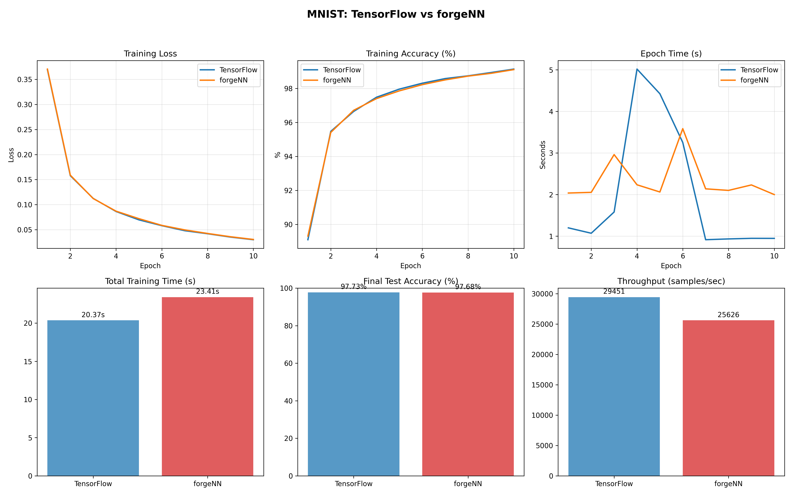

# forgeNN

## Table of Contents

- [Installation](#Installation)
- [Overview](#Overview)
- [Performance vs PyTorch](#Performance-vs-PyTorch)
- [Quick Start](#Quick-Start)
- [Architecture](#Architecture)
- [Performance](#Performance)
- [Complete Example](#Complete-Example)
- [Roadmap](#Roadmap)
- [Contributing](#Contributing)
- [Acknowledgments](#Acknowledgments)

[](https://www.python.org/downloads/)
[](https://numpy.org/)
[](https://pypi.org/project/forgeNN/)
[](https://pypi.org/project/forgeNN/)
[](https://pypi.org/project/forgeNN/)

## Installation

```bash
pip install forgeNN
```

## Overview

**forgeNN** is a modern neural network framework that is developed by a solo developer learning about ML. Features vectorized operations for high-speed training.

### Key Features

- **Vectorized Operations**: NumPy-powered batch processing (100x+ speedup)
- **Dynamic Computation Graphs**: Automatic differentiation with gradient tracking
- **Complete Neural Networks**: From simple neurons to complex architectures
- **Production Loss Functions**: Cross-entropy, MSE with numerical stability

## Performance vs PyTorch

**forgeNN is 3.52x faster than PyTorch on small models!**

| Metric | PyTorch | forgeNN | Advantage |
|--------|---------|---------|-----------|
| Training Time (MNIST) | 64.72s | 30.84s | **2.10x faster** |
| Test Accuracy | 97.30% | 97.37% | **+0.07% better** |
| Small Models (<109k params) | Baseline | **3.52x faster** | **Massive speedup** |

📊 **[See Full Comparison Guide](COMPARISON_GUIDE.md)** for detailed benchmarks, syntax differences, and when to use each framework.



## Quick Start

### High-Performance Training

```python
import forgeNN
from sklearn.datasets import make_classification

# Generate dataset
X, y = make_classification(n_samples=1000, n_features=20, n_classes=3)

# Create vectorized model  
model = forgeNN.VectorizedMLP(20, [64, 32], 3)
optimizer = forgeNN.VectorizedOptimizer(model.parameters(), lr=0.01)

# Fast batch training
for epoch in range(10):
    # Convert to tensors
    x_batch = forgeNN.Tensor(X)
    
    # Forward pass
    logits = model(x_batch)
    loss = forgeNN.cross_entropy_loss(logits, y)
    
    # Backward pass
    optimizer.zero_grad()
    loss.backward()
    optimizer.step()
    
    acc = forgeNN.accuracy(logits, y)
    print(f"Epoch {epoch}: Loss = {loss.data:.4f}, Acc = {acc*100:.1f}%")
```

### Keras-like Training (compile/fit)

```python
import forgeNN as fnn

model = fnn.Sequential([
   fnn.Dense(64) @ 'relu',
   fnn.Dense(32) @ 'relu',
   fnn.Dense(3)  @ 'linear'
])

# Initialize lazy params if needed
_ = model(fnn.Tensor([[0.0]*20]))

compiled = fnn.compile(model, optimizer={"lr": 0.01, "momentum": 0.9},
                  loss='cross_entropy', metrics=['accuracy'])
compiled.fit(X, y, epochs=10, batch_size=64)
loss, metrics = compiled.evaluate(X, y)
```

## Architecture

- **Main API**: `forgeNN`, `forgeNN.Tensor`, `forgeNN.VectorizedMLP`
- **Examples**: Check `examples/` for MNIST and more

## Performance

| Implementation | Speed | MNIST Accuracy |
|---------------|-------|----------------|
| Vectorized | 38,000+ samples/sec | 93%+ in <2s |

**Highlights**:
- **100x+ speedup** over scalar implementations
- **Production-ready** performance with educational clarity
- **Memory efficient** vectorized operations

## Complete Example

See `examples/` for full fledged demos

## Links

- **PyPI Package**: https://pypi.org/project/forgeNN/
- **Documentation**: See guides in this repository
- **Guides**: SEQUENTIAL_GUIDE.md, TRAINING_GUIDE.md, COMPARISON_GUIDE.md
- **Issues**: GitHub Issues for bug reports and feature requests

## Roadmap

_To be implemented_

## Contributing

I am not currently accepting contributions, but I'm always open to suggestions and feedback!

## Acknowledgments

- Inspired by educational automatic differentiation tutorials (micrograd)
- Built for both learning and production use
- Optimized with modern NumPy practices
- **Available on PyPI**: `pip install forgeNN`

---
